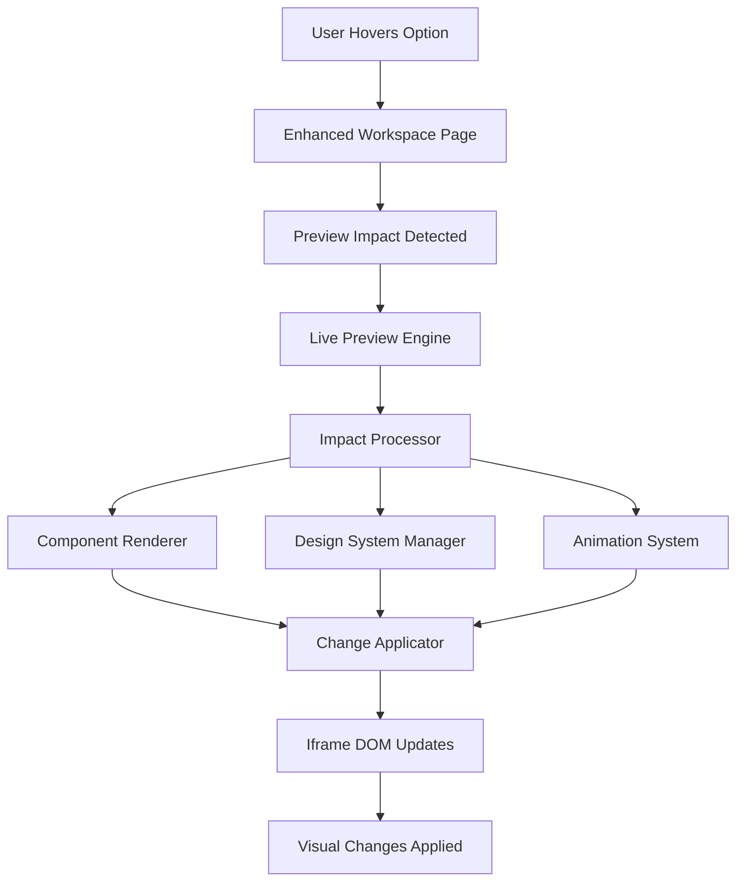

# SheenApps Builder Architecture Documentation

## Overview

The SheenApps Builder is a sophisticated question-driven AI-powered website builder that generates dynamic previews based on user choices. It uses a modular architecture with live preview capabilities and comprehensive visual transformations.

## Architecture Components

### 1. Question Flow System

#### Core Files
- **`src/store/question-flow-store.ts`** - Central state management for question progression
- **`src/services/refinement/enhanced-ideal-ai-response.ts`** - Question definitions and preview impacts
- **`src/services/ai/question-generator.ts`** - Dynamic question generation
- **`src/app/api/questions/generate/route.ts`** - Server-side question API

#### Flow Structure
```typescript
interface QuestionFlowState {
  questionQueue: MCQQuestion[]        // Remaining questions to ask
  currentQuestion: MCQQuestion | null // Current question being displayed
  questionHistory: Answer[]           // Previously answered questions
  completionPercentage: number        // Progress through flow (0-100)
  flowPhase: 'questioning' | 'building' | 'refining'
}
```

#### Question Progression Logic
1. **Initialization**: All 5 questions loaded into `questionQueue`
2. **Answer Submission**: Current question answered, queue advances
3. **Queue Management**: `remainingQueue = state.questionQueue.slice(1)`
4. **Dynamic Generation**: When queue empty, attempts to generate follow-up questions
5. **Completion**: Flow ends when no more questions available

**Critical Bug Fixed**: Queue was being replaced with single question instead of preserving remaining questions.

### 2. Live Preview Engine (Modular Architecture)

#### Core Engine Files
- **`src/services/preview/live-preview-engine.ts`** - Main orchestration (480 lines)
- **`src/services/preview/impact-processor.ts`** - Impact processing logic
- **`src/services/preview/change-applicator.ts`** - DOM manipulation
- **`src/services/preview/component-renderer.ts`** - HTML template generation
- **`src/services/preview/design-system-manager.ts`** - Color schemes and typography
- **`src/services/preview/animation-system.ts`** - Animation presets
- **`src/services/preview/types.ts`** - Shared type definitions

#### Preview System Architecture



#### Modular Transformation System

**Impact Types**:
1. **Modular Transformation** (primary) - Comprehensive component-based changes
2. **Comprehensive Transformation** (legacy) - Full page replacements
3. **Legacy Impact** (fallback) - Simple content changes

**Module Types**:
```typescript
interface ModularImpact {
  type: 'modular-transformation'
  modules: {
    colorScheme?: string           // luxury, warm, minimal, vibrant
    typography?: string            // elegant, modern, playful
    header?: ComponentModule       // Header component with props
    hero?: ComponentModule         // Hero section component
    features?: ComponentModule     // Features section component
    animations?: string[]          // Array of animation preset IDs
    customCSS?: string            // Additional styling
  }
}
```

### 3. Component System

#### Header Components
- **`minimal`** - Clean, professional design
- **`luxury`** - Dark theme with gold accents
- **`playful`** - Colorful with emojis and animations
- **`vibrant-bold`** - Rainbow gradients with bold styling

#### Hero Components
- **`family-focused`** - Warm orange theme for families
- **`professional-efficient`** - Blue/gray professional theme
- **`luxury-experience`** - Dark luxury with gold elements
- **`trendy-creative`** - Vibrant rainbow gradient
- **`warm-community`** - General warm theme
- **`luxury-immersive`** - Premium dark theme
- **`splitLayout`** - Two-column layout

#### Template Interpolation
```typescript
// Example usage in component renderer
ComponentRenderer.interpolate(`
  <h1>{{title}}</h1>
  {{#navItems}}
    <a href="{{url}}">{{label}}</a>
  {{/navItems}}
`, props)
```

### 4. Design System

#### Color Schemes
```typescript
const COLOR_SCHEMES = {
  luxury: {
    primary: '#d4af37',     // Gold
    secondary: '#b8941f',   // Dark gold
    accent: '#000000',      // Black
    background: '#0a0a0a'   // Dark background
  },
  warm: {
    primary: '#f97316',     // Orange
    secondary: '#ea580c',   // Dark orange
    accent: '#ffffff',      // White
    background: '#fef7e7'   // Warm cream
  },
  minimal: {
    primary: '#2563eb',     // Blue
    secondary: '#1d4ed8',   // Dark blue
    accent: '#ffffff',      // White
    background: '#f8fafc'   // Light gray
  },
  vibrant: {
    primary: '#8b5cf6',     // Purple
    secondary: '#7c3aed',   // Dark purple
    accent: '#ffffff',      // White
    background: 'rainbow-gradient'
  }
}
```

#### Typography Systems
- **`elegant`** - Playfair Display, refined spacing
- **`modern`** - Inter, clean and efficient
- **`playful`** - Nunito, friendly and approachable

#### Animation Presets
- **`fadeInUp`** - Slide up with fade
- **`bounce`** - Playful bouncing effect
- **`float`** - Gentle floating motion
- **`shimmer`** - Subtle shine effect
- **`gradientShift`** - Animated color transitions
- **`wiggle`** - Slight rotation animation

### 5. Question Definitions (5 Questions)

#### Question 1: Visual Foundation
**ID**: `visual-foundation-1`
**Question**: "What personality should your salon app convey?"

**Options**:
- **Luxury & Premium** - Dark luxury theme with comprehensive modules
- **Warm & Approachable** - Orange warm theme with community focus
- **Modern & Minimal** - Clean blue theme with efficiency focus
- **Bold & Vibrant** - Rainbow theme with creative elements

#### Question 2: Target Audience  
**ID**: `target-audience-1`
**Question**: "Who is your primary target audience?"

**Options**:
- **Families with Children** - Warm orange theme, playful header, family-focused hero
- **Young Professionals** - Minimal blue theme, clean header, efficiency-focused hero
- **Luxury Clientele** - Dark luxury theme, elegant header, premium experience hero
- **Trendy Youth** - Vibrant rainbow theme, bold header, creative hero

#### Question 3: Business Focus
**ID**: `business-focus-1`
**Question**: "What's your salon's main focus?"

#### Question 4: User Experience
**ID**: `user-experience-1`  
**Question**: "How should customers interact with your app?"

#### Question 5: Feature Priorities
**ID**: `feature-priorities-1`
**Question**: "Which features are most important for your salon?"

### 6. Integration Points

#### Enhanced Workspace Page
**File**: `src/components/builder/enhanced-workspace-page.tsx`

**Key Functions**:
- `handleOptionHover()` - Triggers preview on hover
- `handleOptionSelect()` - Applies permanent changes on selection
- Preview engine initialization and management
- Iframe container management

#### Question Interface
**File**: `src/components/builder/question-flow/question-interface.tsx`

**Responsibilities**:
- Rendering current question and options
- Handling user interactions
- Progress tracking
- Option hover/selection events

### 7. Data Flow

#### Option Hover Flow
```
1. User hovers option
2. handleOptionHover() called with option data
3. Preview impact extracted from option.previewImpact
4. LivePreviewEngine.applyPreviewImpact() called
5. ImpactProcessor.processImpact() determines impact type
6. Modular modules processed (colorScheme, typography, header, hero, etc.)
7. ComponentRenderer generates HTML for components
8. DesignSystemManager applies color/typography CSS
9. ChangeApplicator sends changes to iframe via postMessage
10. Iframe applies DOM changes and CSS updates
11. Visual transformation visible to user
```

#### Question Progression Flow
```
1. User selects option
2. submitAnswer() called in question-flow-store
3. Answer added to questionHistory
4. Next question pulled from questionQueue
5. Queue advanced: remainingQueue = questionQueue.slice(1)
6. State updated with new currentQuestion and remainingQueue
7. UI renders next question
8. Process repeats until all 5 questions answered
```

### 8. Common Issues & Solutions

#### Preview Not Working
- **Symptom**: No visual changes on hover
- **Causes**: Missing hero components, undefined color schemes, iframe not initialized
- **Solution**: Check component-renderer.ts for missing generators, verify design-system-manager.ts definitions

#### Only 2 Questions Showing  
- **Symptom**: Flow stops after 2 questions
- **Cause**: questionQueue being replaced instead of advanced
- **Solution**: Ensure `questionQueue: remainingQueue` not `questionQueue: [nextQuestion]`

#### Modular vs Legacy Impacts
- **Modular**: Uses `modularPreviewImpact` with comprehensive modules
- **Legacy**: Uses simple content replacement
- **Detection**: Impact processor checks for `modularPreviewImpact` property first

### 9. Development Workflow

#### Adding New Questions
1. Add question definition to `enhanced-ideal-ai-response.ts`
2. Define comprehensive `modularPreviewImpact` with all modules
3. Update `totalExpectedQuestions` in question-flow-store.ts
4. Test question progression and preview impacts

#### Adding New Components
1. Add component generator to `component-renderer.ts`
2. Register in component generators mapping
3. Define props interface in `types.ts`
4. Test with sample modular impact

#### Adding New Color Schemes
1. Define scheme in `design-system-manager.ts`
2. Add CSS variables and background styles
3. Test with existing components
4. Update question options to use new scheme

### 10. Performance Considerations

#### Iframe Communication
- Uses postMessage API for secure cross-frame communication
- Changes applied in batches to minimize DOM thrashing
- CSS variables used for efficient style updates

#### Module Processing
- Modular impacts processed in parallel where possible
- Component HTML generated on-demand
- CSS injection optimized with unique IDs to prevent duplicates

#### State Management
- Question queue managed efficiently to avoid unnecessary re-renders
- Preview changes debounced on hover
- Engagement tracking batched to reduce API calls

## Future Enhancements

### Dynamic Question Generation
- Implement AI-powered follow-up questions based on answers
- Create conditional question branches
- Add contextual questions based on business type

### Extended Component Library
- Add more hero variants for different industries
- Implement feature section components
- Create footer component options

### Advanced Animations
- Add more sophisticated animation presets
- Implement stagger animations for multiple elements
- Create entrance/exit animation sequences

### Preview Improvements
- Add mobile preview mode
- Implement real-time collaboration features
- Add undo/redo for preview changes