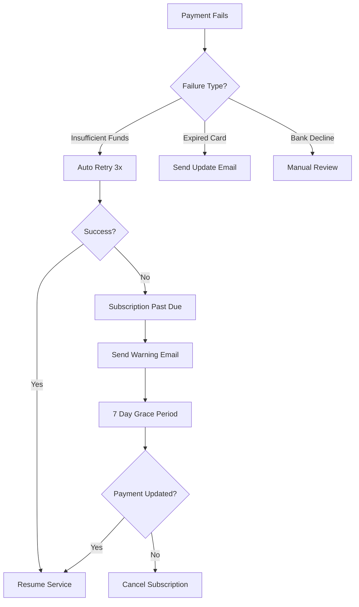

# Payment System Operational Runbook

## Table of Contents
1. [System Overview](#system-overview)
2. [Daily Operations](#daily-operations)
3. [Payment Failure Handling](#payment-failure-handling)
4. [Webhook Troubleshooting](#webhook-troubleshooting)
5. [Subscription Management](#subscription-management)
6. [Incident Response](#incident-response)
7. [Monitoring & Alerts](#monitoring--alerts)
8. [Emergency Procedures](#emergency-procedures)

## System Overview

### Architecture Components
- **Payment Gateways**: Stripe (primary), Cashier (Egypt), PayPal (future)
- **Database**: Supabase PostgreSQL
- **Webhook Processing**: Dead letter queue with retry
- **Admin Dashboard**: `/admin` for monitoring
- **Cron Jobs**: Trial notifications, bonus expiry, webhook retry

### Critical Tables
- `transactions` - Unified payment records
- `subscriptions` - Active subscription status
- `webhook_dead_letter` - Failed webhooks
- `usage_tracking` - Feature usage metrics
- `usage_bonuses` - Bonus credits

## Daily Operations

### Morning Checklist (9 AM)
1. **Check Failed Payments** 
   ```
   Navigate to: /admin/payments
   Look for: New failures in last 24h
   Action: Investigate patterns, contact users if needed
   ```

2. **Review Webhook Status**
   ```
   Navigate to: /admin/webhooks
   Check: Failed webhooks count
   Action: Manual retry if needed
   ```

3. **Monitor MRR Changes**
   ```
   Navigate to: /admin/revenue
   Check: Unexpected drops or spikes
   Action: Investigate anomalies
   ```

### Weekly Tasks

#### Monday - Revenue Review
1. Check weekly MRR trend
2. Review churn rate
3. Identify at-risk customers
4. Plan retention outreach

#### Wednesday - System Health
1. Check webhook retry stats
2. Review rate limiting logs
3. Verify cron job execution
4. Clean up old webhook logs

#### Friday - Usage Analysis
1. Review power user activity
2. Check quota hit rates
3. Identify upgrade opportunities
4. Plan feature announcements

## Payment Failure Handling

### Common Failure Types

#### 1. Insufficient Funds
**Symptoms**: `card_declined`, `insufficient_funds`
**Actions**:
1. Automatic retry scheduled by Stripe
2. Send payment update email (automated)
3. After 3 failures: Subscription to `past_due`
4. After 7 days: Cancel subscription

**Manual Intervention**:
```sql
-- Find affected users
SELECT u.email, s.status, t.error_message
FROM subscriptions s
JOIN customers c ON s.customer_id = c.id
JOIN auth.users u ON c.user_id = u.id
LEFT JOIN transactions t ON t.user_id = u.id
WHERE s.status IN ('past_due', 'unpaid')
ORDER BY s.updated_at DESC;
```

#### 2. Expired Card
**Symptoms**: `card_expired`, `invalid_expiry_year`
**Actions**:
1. Stripe sends automatic card update email
2. User updates via Customer Portal
3. Monitor for successful update

**Check Card Updates**:
```bash
# Via Stripe CLI
stripe customers retrieve cus_xxx --live
```

#### 3. Bank Rejection
**Symptoms**: `generic_decline`, `do_not_honor`
**Actions**:
1. Contact user directly (high-value only)
2. Suggest alternative payment method
3. Offer temporary extension if needed

### Payment Recovery Workflow



## Webhook Troubleshooting

### Common Webhook Issues

#### 1. Signature Verification Failed
**Error**: `Webhook signature verification failed`
**Causes**:
- Wrong webhook secret
- Modified payload
- Encoding issues

**Fix**:
```bash
# Verify webhook secret
echo $STRIPE_WEBHOOK_SECRET

# Test with Stripe CLI
stripe listen --forward-to localhost:3000/api/stripe-webhook
```

#### 2. Webhook Timeout
**Error**: `Webhook processing timeout`
**Causes**:
- Slow database queries
- External API calls
- Large payload processing

**Fix**:
1. Check webhook processing time
2. Optimize database queries
3. Move heavy operations to background jobs

#### 3. Duplicate Webhook Processing
**Symptoms**: Multiple subscription records, duplicate charges
**Causes**:
- Missing idempotency
- Webhook retry without deduplication

**Fix**:
```sql
-- Check for duplicates
SELECT 
  gateway_transaction_id,
  COUNT(*) as count
FROM transactions
GROUP BY gateway_transaction_id
HAVING COUNT(*) > 1;

-- Add unique constraint if missing
ALTER TABLE transactions 
ADD CONSTRAINT unique_gateway_transaction 
UNIQUE (gateway, gateway_transaction_id);
```

### Webhook Dead Letter Queue

#### Check Failed Webhooks
```sql
-- Recent failures
SELECT 
  id,
  gateway,
  event_type,
  retry_count,
  error_message,
  created_at
FROM webhook_dead_letter
WHERE retry_count >= max_retries
ORDER BY created_at DESC
LIMIT 20;
```

#### Manual Webhook Retry
```bash
# Via Admin API
curl -X POST https://app.sheenapps.com/api/admin/webhooks/retry \
  -H "Authorization: Bearer $ADMIN_TOKEN" \
  -H "Content-Type: application/json" \
  -d '{"webhookId": "webhook-uuid-here"}'
```

#### Clear Stuck Webhooks
```sql
-- Archive old failed webhooks (>30 days)
UPDATE webhook_dead_letter
SET archived = true
WHERE created_at < NOW() - INTERVAL '30 days'
  AND retry_count >= max_retries;
```

## Subscription Management

### Common Operations

#### 1. Manual Subscription Cancel
```typescript
// Via API
POST /api/admin/subscriptions/cancel
{
  "subscriptionId": "sub_xxx",
  "reason": "Customer request",
  "feedback": "Too expensive"
}
```

#### 2. Apply Credit/Refund
```bash
# Via Stripe CLI
stripe refunds create \
  --charge=ch_xxx \
  --amount=500 \
  --reason=requested_by_customer
```

#### 3. Change Subscription Plan
```sql
-- Check current plan
SELECT 
  s.id,
  s.plan_name,
  s.status,
  u.email
FROM subscriptions s
JOIN customers c ON s.customer_id = c.id
JOIN auth.users u ON c.user_id = u.id
WHERE u.email = 'customer@example.com';
```

#### 4. Extend Trial
```typescript
// Via Trial API
POST /api/trials/extend
{
  "userId": "user-uuid",
  "days": 7,
  "reason": "Customer request"
}
```

### Subscription States

| Status | Description | Actions |
|--------|-------------|---------|
| `active` | Normal, paid | None |
| `trialing` | In trial period | Monitor conversion |
| `past_due` | Payment failed | Recovery flow |
| `canceled` | User canceled | Retention offer |
| `paused` | Temporarily stopped | Check resume date |
| `unpaid` | Multiple failures | Final notice |

## Incident Response

### Severity Levels

#### SEV-1: Critical (All payments failing)
**Response Time**: Immediate
**Team**: Engineering Lead + CTO
**Examples**:
- All webhooks failing
- Database connection lost
- Payment gateway down

#### SEV-2: Major (Some payments failing)
**Response Time**: 30 minutes
**Team**: On-call engineer
**Examples**:
- High failure rate (>10%)
- Specific country/gateway issues
- Webhook delays >5 min

#### SEV-3: Minor (Isolated issues)
**Response Time**: 2 hours
**Team**: Support team
**Examples**:
- Individual payment failures
- UI bugs in billing page
- Slow dashboard loading

### Incident Response Checklist

#### 1. Assess Impact
- [ ] Check payment success rate
- [ ] Count affected users
- [ ] Calculate revenue impact
- [ ] Check gateway status pages

#### 2. Immediate Actions
- [ ] Post status update
- [ ] Enable maintenance mode (if needed)
- [ ] Stop affected cron jobs
- [ ] Alert senior leadership

#### 3. Diagnosis
- [ ] Check error logs
- [ ] Review recent deployments
- [ ] Verify gateway credentials
- [ ] Test payment flow manually

#### 4. Resolution
- [ ] Implement fix
- [ ] Test thoroughly
- [ ] Deploy carefully
- [ ] Monitor metrics

#### 5. Post-Incident
- [ ] Write incident report
- [ ] Update runbooks
- [ ] Schedule retrospective
- [ ] Implement preventive measures

### Common Incident Patterns

#### Pattern: Spike in Failed Payments
```sql
-- Quick diagnosis query
SELECT 
  DATE_TRUNC('hour', created_at) as hour,
  gateway,
  COUNT(*) as failures,
  COUNT(DISTINCT user_id) as affected_users
FROM transactions
WHERE status = 'failed'
  AND created_at > NOW() - INTERVAL '24 hours'
GROUP BY hour, gateway
ORDER BY hour DESC;
```

#### Pattern: Webhook Processing Delays
```sql
-- Check webhook queue depth
SELECT 
  COUNT(*) as pending_webhooks,
  MIN(created_at) as oldest_webhook,
  MAX(retry_count) as max_retries
FROM webhook_dead_letter
WHERE retry_count < max_retries;
```

## Monitoring & Alerts

### Key Metrics to Monitor

#### Business Metrics
- **MRR**: Alert if drops >5% daily
- **Churn Rate**: Alert if >10% monthly
- **Failed Payment Rate**: Alert if >5%
- **Trial Conversion**: Alert if <20%

#### Technical Metrics
- **Webhook Success Rate**: Alert if <95%
- **API Response Time**: Alert if >1s
- **Database Connection Pool**: Alert if >80%
- **Rate Limit Hits**: Alert if >100/hour

### Alert Response Matrix

| Alert | Severity | Response Time | Action |
|-------|----------|---------------|---------|
| MRR drop >10% | SEV-2 | 30 min | Investigate cancellations |
| All webhooks failing | SEV-1 | Immediate | Check webhook endpoint |
| High rate limit hits | SEV-3 | 2 hours | Review traffic patterns |
| Database pool exhausted | SEV-1 | Immediate | Scale connections |

### Monitoring Queries

#### Daily Health Check
```sql
-- Payment success rate
SELECT 
  DATE(created_at) as date,
  COUNT(*) FILTER (WHERE status = 'completed') * 100.0 / COUNT(*) as success_rate
FROM transactions
WHERE created_at > NOW() - INTERVAL '7 days'
GROUP BY date
ORDER BY date DESC;

-- Active subscriptions
SELECT 
  plan_name,
  COUNT(*) as count,
  SUM(CASE WHEN status = 'active' THEN 1 ELSE 0 END) as active
FROM subscriptions
GROUP BY plan_name;
```

## Emergency Procedures

### Payment Gateway Outage

#### Stripe Outage
1. Check https://status.stripe.com
2. Enable fallback messaging
3. Queue critical operations
4. Communicate with customers

#### Database Outage
1. Check Supabase status
2. Enable read-only mode
3. Queue webhook events locally
4. Prepare failover plan

### Emergency Contacts

| Service | Contact | Escalation |
|---------|---------|------------|
| Stripe | support@stripe.com | Enterprise support |
| Supabase | support@supabase.io | Status page |
| Internal | oncall@sheenapps.com | CTO |

### Rollback Procedures

#### Code Rollback
```bash
# Via deployment platform
vercel rollback --prod

# Or git revert
git revert HEAD
git push origin main
```

#### Database Rollback
```sql
-- Always backup first
pg_dump $DATABASE_URL > backup_$(date +%s).sql

-- Restore if needed
psql $DATABASE_URL < backup_timestamp.sql
```

## Appendix

### Useful Commands

#### Stripe CLI Commands
```bash
# List recent events
stripe events list --limit 10

# Replay specific event
stripe events resend evt_xxx

# Check customer
stripe customers retrieve cus_xxx

# View subscription
stripe subscriptions retrieve sub_xxx
```

#### Database Queries
```sql
-- Find user by email
SELECT u.id, c.stripe_customer_id, s.*
FROM auth.users u
LEFT JOIN customers c ON u.id = c.user_id
LEFT JOIN subscriptions s ON c.id = s.customer_id
WHERE u.email = 'user@example.com';

-- Recent high-value failures
SELECT 
  t.*,
  u.email
FROM transactions t
JOIN auth.users u ON t.user_id = u.id
WHERE t.status = 'failed'
  AND t.amount_cents > 5000
  AND t.created_at > NOW() - INTERVAL '24 hours';
```

### Error Code Reference

| Code | Meaning | Action |
|------|---------|---------|
| `card_declined` | Generic decline | Customer action needed |
| `insufficient_funds` | No money | Retry later |
| `expired_card` | Card expired | Update payment method |
| `incorrect_cvc` | Wrong CVC | Customer retry |
| `processing_error` | Gateway issue | Retry |

---

*Last Updated: 27 June 2025*
*Version: 1.0*