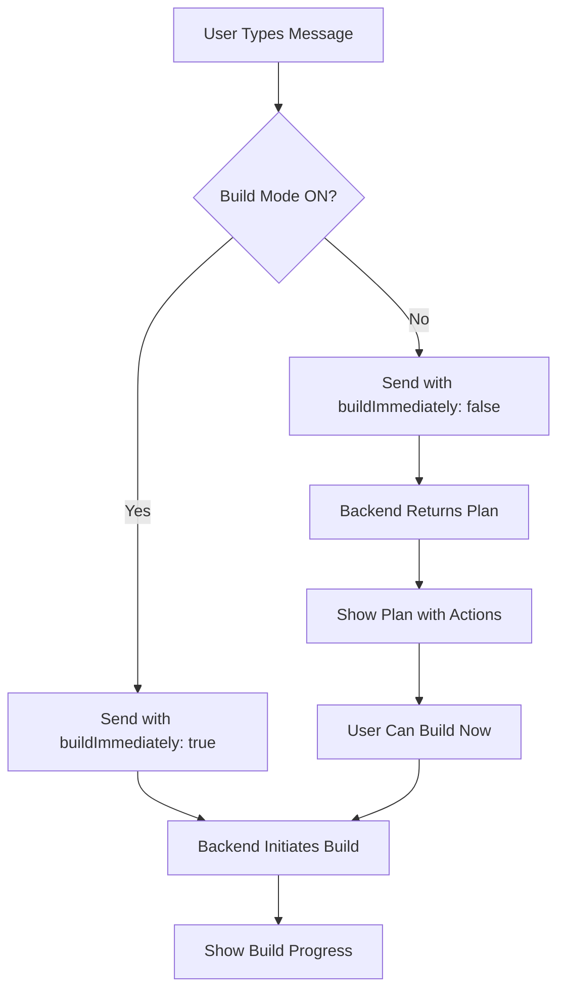

# Unified Chat Mode Implementation Summary

## Problem Solved
Beta users reported not noticing the separate "Plan Mode" button, leading to poor discoverability of the planning/analysis features. The solution creates a unified chat experience with an always-visible toggle that controls whether messages trigger immediate builds or just create plans.

## Implementation Overview

### Backend Changes

#### 1. Database Schema (`migrations/035_add_unified_chat_preferences.sql`)
- Added `chat_preferences` JSONB column to `projects` table to store user preferences
- Created `unified_chat_sessions` table for tracking mode usage and analytics
- Added columns to `project_chat_log_minimal` for tracking mode at message creation

#### 2. Core Service (`src/services/unifiedChatService.ts`)
- **UnifiedChatService** class handles both plan and build modes seamlessly
- Intelligent routing based on `buildImmediately` flag
- Session management and continuity across mode switches
- Preference persistence per project
- Analytics tracking for mode usage and conversions

#### 3. API Endpoints (`src/routes/unifiedChat.ts`)
- `POST /v1/chat/unified` - Main endpoint accepting `buildImmediately` flag
- `GET /v1/projects/:projectId/chat-preferences` - Get saved preferences
- `PUT /v1/projects/:projectId/chat-preferences` - Update preferences
- `POST /v1/chat/convert-to-build` - Convert plans to builds

#### 4. Integration
- Routes registered in `src/server.ts`
- Full backward compatibility with existing endpoints
- SSE streaming support for real-time updates

## Frontend Requirements

### UI Components Needed

1. **Toggle Component**
   - Checkbox/switch labeled "🚀 Build Immediately"
   - Checked = Build mode (immediate execution)
   - Unchecked = Plan mode (analysis only)
   - Saves preference automatically

2. **Visual Mode Indicators**
   - Clear indication of current mode in chat
   - Different colors/icons for each mode
   - Disabled state during active builds

3. **Action Buttons**
   - "Build This Now" button in plan mode responses
   - "Cancel Build" during active builds
   - "Switch Mode" when appropriate

### Implementation Flow

## Key Benefits

1. **Better Discoverability** - Toggle is always visible, no hidden buttons
2. **Seamless Experience** - Single chat interface for both modes
3. **User Preference** - Mode choice persists per project
4. **Clear Feedback** - Visual indicators show current mode
5. **Flexibility** - Users can switch modes anytime (when not building)
6. **Smart Conversion** - Plans can be converted to builds with one click

## Migration Path

### For Frontend Team
1. Add toggle component to chat header
2. Update API calls to use `/v1/chat/unified`
3. Handle both plan and build responses
4. Add visual mode indicators
5. Implement preference persistence

### For Users
- Existing functionality remains unchanged
- New toggle appears in chat interface
- Default is "Build Immediately" (current behavior)
- Can switch to Plan Mode by unchecking toggle

## Analytics & Monitoring

The implementation tracks:
- Mode usage per session
- Mode transitions
- Plan to build conversion rate
- User preference changes
- Session duration by mode

## Testing Checklist

Backend (Completed):
- ✅ Database migration created
- ✅ UnifiedChatService implemented
- ✅ API endpoints created
- ✅ Routes registered
- ✅ Backward compatibility maintained

Frontend (Required):
- [ ] Toggle component implementation
- [ ] API integration with unified endpoint
- [ ] Mode preference persistence
- [ ] Visual mode indicators
- [ ] Build progress handling
- [ ] Plan to build conversion
- [ ] Error handling
- [ ] User testing

## Next Steps

1. **Immediate**: Run database migration on staging/production
2. **Frontend**: Implement toggle UI and integrate with new API
3. **Testing**: Full E2E testing of unified experience
4. **Rollout**: Gradual rollout with feature flag if needed
5. **Monitor**: Track adoption and mode usage analytics

## Files Created/Modified

### New Files
- `/migrations/035_add_unified_chat_preferences.sql`
- `/src/services/unifiedChatService.ts`
- `/src/routes/unifiedChat.ts`
- `/docs/UNIFIED_CHAT_FRONTEND_INTEGRATION.md`
- `/docs/UNIFIED_CHAT_IMPLEMENTATION_SUMMARY.md`

### Modified Files
- `/src/server.ts` - Added route registration

## Contact

For questions about the implementation or integration, refer to:
- Frontend Guide: `/docs/UNIFIED_CHAT_FRONTEND_INTEGRATION.md`
- API Reference: Standard HMAC-authenticated endpoints
- Backend Team: For any API clarifications

## Success Metrics

Monitor after deployment:
- Increase in Plan Mode usage (target: 3x current usage)
- User satisfaction with discoverability
- Reduction in support tickets about finding Plan Mode
- Conversion rate from plans to builds
- Mode switching frequency

This implementation provides a more intuitive and discoverable way for users to control whether their messages trigger immediate builds or just generate plans for review.