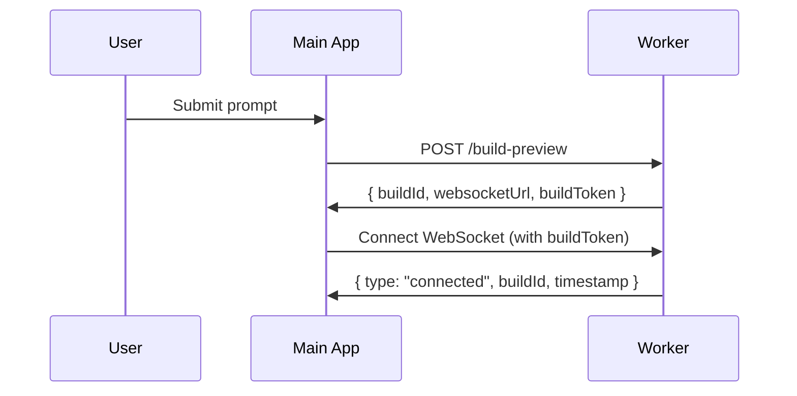
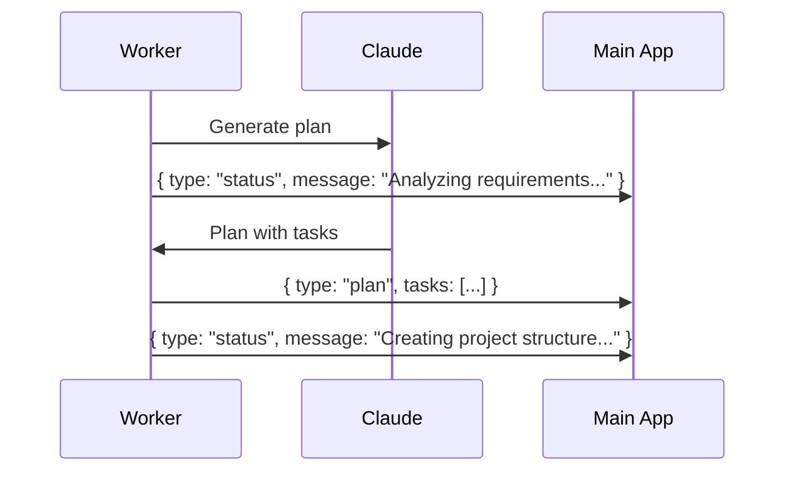
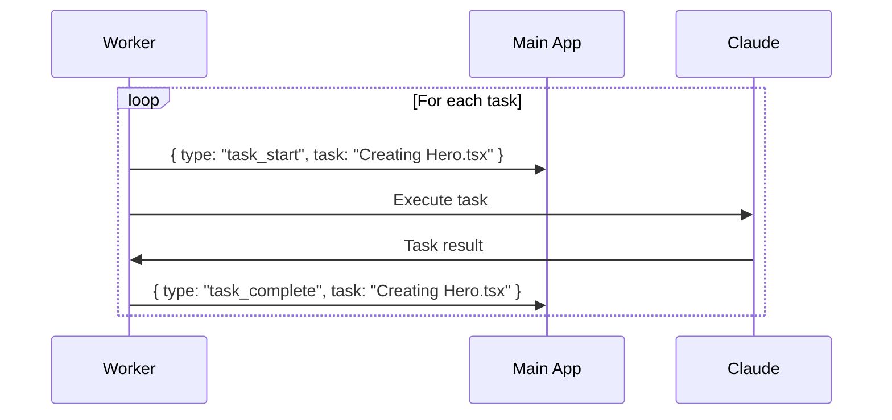
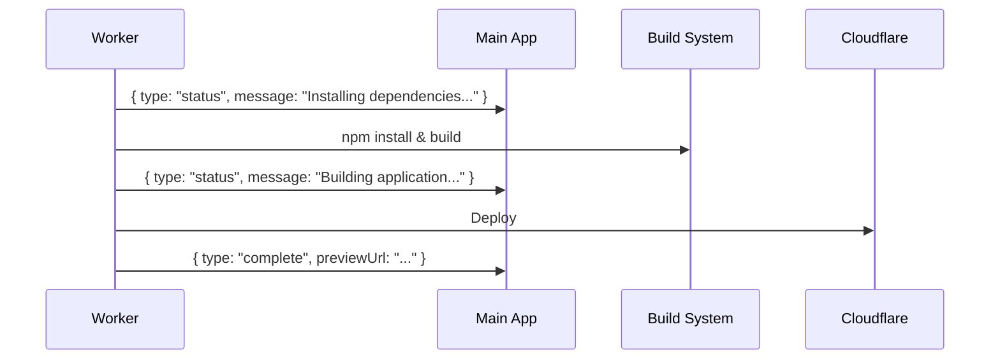

# Worker-Main App Communication Plan

## Overview

This document outlines the comprehensive plan for enabling real-time communication between the Claude Worker service and the main Next.js application on sheenapps.com, providing users with an interactive experience showing live progress updates during app generation and modification.

## Current State Analysis

### Worker Service (This App)
- **Architecture**: Modular system with separate workers for planning and task execution
- **Current Flow**:
  1. Receives request via REST API
  2. Generates plan using Claude
  3. Executes tasks (creates files)
  4. ❌ Missing: Build step
  5. ❌ Missing: Deploy to Cloudflare Pages
  6. ❌ Missing: Real-time progress updates to main app

### Main App (sheenapps.com)
- **Tech Stack**: Next.js
- **User Flow**:
  1. User submits business idea/prompt
  2. ⏳ Waiting... (no updates)
  3. Eventually gets result (or timeout)

## Desired User Experience

### Initial App Generation
```
User: "Create a todo app with dark mode"
System shows real-time updates:
✓ Analyzing requirements...
✓ Creating project structure...
⚡ Creating components/TodoList.tsx...
⚡ Setting up dark mode theme...
⚡ Configuring Tailwind CSS...
✓ Installing dependencies...
✓ Building application...
✓ Deploying to preview...
🎉 Your app is ready! [View Preview]
```

### Incremental Updates
```
User: "Add a search feature"
System shows:
✓ Understanding changes needed...
⚡ Updating components/TodoList.tsx...
⚡ Creating components/SearchBar.tsx...
✓ Rebuilding application...
✓ Deploying update...
🎉 Search feature added! [View Updated Preview]
```

## Communication Architecture

### 1. WebSocket Connection (Recommended)
- **Why**: Real-time bidirectional communication
- **Implementation**: Socket.io with namespaces
- **Flow**:
  ```
  Main App <--WebSocket--> Worker Service
  ```
- **Enhanced Security**: 
  - Namespace per build to prevent broadcast leaks
  - Build-specific JWT tokens for authentication
  - Rotatable secrets per build

### 2. Server-Sent Events (Alternative)
- **Why**: Simpler, one-way communication
- **Implementation**: SSE from worker to main app
- **Flow**:
  ```
  Main App <--SSE-- Worker Service
  ```

### 3. Server-Sent Events (Fallback)
- **Why**: Works through firewalls/proxies, no polling needed
- **Implementation**: SSE endpoint at `/events/:buildId`
- **Flow**:
  ```
  Main App <--SSE-- Worker Service
  ```
- **Auto-switch**: If WebSocket handshake fails, client automatically falls back to SSE

## Complete Flow Design

### Phase 1: Request Initiation


### Phase 2: Planning & Progress


### Phase 3: Task Execution


### Phase 4: Build & Deploy


## Event Types

### 1. Status Events
```typescript
interface StatusEvent {
  type: 'status';
  code?: 'COMPILING' | 'LINTING' | 'TESTING' | 'BUILDING'; // Compact codes
  message: string;
  progress?: number; // 0-100
  timestamp: string; // ISO 8601 format
}
```

### 2. Plan Events
```typescript
interface PlanEvent {
  type: 'plan_generated';
  plan: {
    id: string;
    tasks: Array<{
      id: string;
      name: string;
      description: string;
      estimatedDuration: number;
    }>;
    totalEstimatedTime: number;
  };
}
```

### 3. Task Events
```typescript
interface TaskEvent {
  type: 'task_started' | 'task_completed' | 'task_failed';
  taskId: string;
  taskName: string;
  details?: {
    filesCreated?: string[];
    filesModified?: string[];
    error?: string;
  };
}
```

### 4. Build Events
```typescript
interface BuildEvent {
  type: 'build_started' | 'build_progress' | 'build_completed' | 'build_failed';
  stage?: 'dependencies' | 'compile' | 'optimize';
  logs?: string[];
  buildLogUrl?: string; // Presigned URL for full logs
  timestamp: string;
  severity?: 'info' | 'warning' | 'error' | 'fatal';
}
```

### 5. Deployment Events
```typescript
interface DeploymentEvent {
  type: 'deploy_started' | 'deploy_progress' | 'deploy_completed' | 'deploy_failed';
  previewUrl?: string;
  deploymentId?: string;
  deployLogUrl?: string; // Cloudflare Pages logs
  timestamp: string;
}
```

## Implementation Plan

### Phase 1: Core Infrastructure (Week 1)

#### 1.1 WebSocket Service
```typescript
// src/services/websocketService.ts
export class WebSocketService {
  private io: Server;
  private connections: Map<string, Socket>;
  private buildTokens: Map<string, string>; // JWT tokens per build
  
  async broadcastToBuild(buildId: string, event: any) {
    // Use namespace for isolation
    this.io.of(`/${buildId}`).emit('update', {
      ...event,
      timestamp: new Date().toISOString(),
      requestId: event.requestId || buildId
    });
  }
  
  generateBuildToken(buildId: string): string {
    // Generate JWT scoped to this build
    return jwt.sign({ buildId, exp: Date.now() + 3600000 }, process.env.JWT_SECRET);
  }
}
```

#### 1.2 Event Emitter Integration
- Add event emissions throughout the worker flow
- Create standardized event format
- Add event buffering for disconnections

#### 1.3 Build & Deploy Integration
- Add build step after task completion
- Add Cloudflare Pages deployment
- Emit progress events during build/deploy

### Phase 2: Worker Updates (Week 1-2)

#### 2.1 Modular Worker Enhancement
```typescript
// Add to plan worker
await websocketService.emit(buildId, {
  type: 'status',
  message: 'Analyzing your requirements...',
  emoji: '🤔'
});

// Add to task worker
await websocketService.emit(buildId, {
  type: 'task_started',
  taskName: 'Creating Hero Component',
  taskId: task.id
});
```

#### 2.2 Build Worker Creation
```typescript
export const buildWorker = new Worker(
  'builds',
  async (job) => {
    const { buildId, projectPath } = job.data;
    
    // Install dependencies
    await websocketService.emit(buildId, {
      type: 'status',
      message: 'Installing dependencies...',
      emoji: '📦'
    });
    
    // Build project
    await websocketService.emit(buildId, {
      type: 'status',
      message: 'Building your application...',
      emoji: '🔨'
    });
    
    // Deploy
    await websocketService.emit(buildId, {
      type: 'status',
      message: 'Deploying to preview...',
      emoji: '🚀'
    });
  }
);
```

### Phase 3: Main App Integration (Week 2)

#### 3.1 WebSocket Client Hook
```typescript
// useBuilderProgress.ts
export function useBuilderProgress(buildId: string) {
  const [events, setEvents] = useState<BuildEvent[]>([]);
  const [status, setStatus] = useState<BuildStatus>('initializing');
  
  useEffect(() => {
    const socket = io(WORKER_WEBSOCKET_URL);
    
    socket.emit('subscribe', { buildId });
    
    socket.on('update', (event) => {
      setEvents(prev => [...prev, event]);
      updateStatus(event);
    });
    
    return () => socket.disconnect();
  }, [buildId]);
  
  return { events, status };
}
```

#### 3.2 Progress UI Component
```tsx
export function BuildProgress({ buildId }: { buildId: string }) {
  const { events, status } = useBuilderProgress(buildId);
  
  return (
    <div className="space-y-4">
      {events.map((event, i) => (
        <ProgressItem key={i} event={event} />
      ))}
    </div>
  );
}
```

### Phase 4: Error Handling & Recovery (Week 2-3)

#### 4.1 Connection Management
- Auto-reconnection with exponential backoff
- Event replay on reconnection
- Automatic fallback to Server-Sent Events (SSE) if WebSocket fails
- Circuit breaker: halt builds after n failures in m minutes

#### 4.2 Error Classification
```typescript
interface ErrorEvent {
  type: 'error';
  severity: 'soft' | 'fatal'; // Soft = retryable, Fatal = abort
  code: string;
  message: string;
  timestamp: string;
  retryable: boolean;
  suggestedAction?: string;
}
```

#### 4.2 Progress Persistence
- Store events in Redis
- Allow progress recovery on page refresh
- Show historical build logs

### Phase 5: Optimizations (Week 3)

#### 5.1 Event Batching
- Batch rapid events (e.g., multiple file creations)
- Throttle updates to prevent UI overload
- Prioritize important events

#### 5.2 Performance
- Use Redis pub/sub for horizontal scaling
- Implement event compression
- Add CDN for static assets

## Database Schema Updates

### 1. Build Events Table
```sql
CREATE TABLE build_events (
  id SERIAL PRIMARY KEY,
  build_id VARCHAR(26) NOT NULL,
  event_type VARCHAR(50) NOT NULL,
  event_data JSONB NOT NULL,
  created_at TIMESTAMP DEFAULT NOW(),
  INDEX idx_build_events_build_id (build_id)
);
```

### 2. Build Progress Table
```sql
CREATE TABLE build_progress (
  build_id VARCHAR(26) PRIMARY KEY,
  status VARCHAR(50) NOT NULL,
  steps_jsonb JSONB DEFAULT '[]', -- Array of step IDs for accurate tracking
  completed_steps JSONB DEFAULT '[]',
  preview_url TEXT,
  error_message TEXT,
  build_log_url TEXT, -- Presigned URL for logs
  updated_at TIMESTAMP DEFAULT NOW()
);
```

## Configuration Requirements

### Environment Variables
```env
# WebSocket Configuration
WEBSOCKET_PORT=3001
WEBSOCKET_CORS_ORIGIN=https://sheenapps.com
REDIS_PUBSUB_URL=redis://localhost:6379

# Build Configuration
BUILD_TIMEOUT_MS=300000
DEPLOY_TIMEOUT_MS=120000

# Main App Configuration
MAIN_APP_URL=https://sheenapps.com
MAIN_APP_WEBHOOK_SECRET=xxx
```

## Security Considerations

1. **Authentication**: Use JWT tokens for WebSocket connections
2. **Rate Limiting**: Limit events per connection
3. **Input Validation**: Validate all incoming WebSocket messages
4. **CORS**: Restrict WebSocket origins to main app domain
5. **Encryption**: Use WSS (WebSocket Secure) in production

## Monitoring & Metrics

### Key Metrics to Track
1. WebSocket connection count
2. Events per second
3. Build completion rate
4. Average build time per stage
5. Error rates by type
6. Circuit breaker triggers
7. SSE fallback usage

### Prometheus Metrics Endpoint
```typescript
// GET /metrics
app.get('/metrics', (req, res) => {
  res.type('text/plain');
  res.send(`
# HELP websocket_active_connections gauge
# TYPE websocket_active_connections gauge
websocket_active_connections ${wsService.getConnectionCount()}

# HELP build_events_total counter
# TYPE build_events_total counter
build_events_total{type="task_started"} ${metrics.taskStarted}
build_events_total{type="task_completed"} ${metrics.taskCompleted}
  `);
});
```

### Logging Strategy
```typescript
logger.info('Build progress', {
  buildId,
  eventType: event.type,
  timestamp: new Date().toISOString(),
  requestId: req.headers['x-request-id'] || buildId, // Distributed tracing
  metadata: event
});
```

## Testing Strategy

### 1. Unit Tests
- Event emission verification
- WebSocket message handling
- Error scenario coverage

### 2. Integration Tests
- Full flow from request to deployment
- WebSocket connection lifecycle
- Progress event sequence validation

### 3. Load Tests
- Multiple concurrent builds
- WebSocket connection limits
- Event throughput testing

## Migration Plan

### Step 1: Deploy WebSocket Service (No Breaking Changes)
- Add WebSocket service alongside existing API
- Start emitting events (even if no one listening)
- Test with internal tools

### Step 2: Main App Soft Launch
- Add progress UI behind feature flag
- Test with beta users
- Monitor performance

### Step 3: Full Rollout
- Enable for all users
- Remove legacy polling code
- Optimize based on metrics

## Success Metrics

1. **User Engagement**: 80% of users watch full build process
2. **Performance**: <100ms event latency
3. **Reliability**: 99.9% WebSocket uptime
4. **User Satisfaction**: Positive feedback on progress visibility

## Additional Enhancements

### Streaming Deployment Logs
```typescript
// Forward Cloudflare Pages deployment logs in real-time
deployWorker.on('cloudflare-log', (log) => {
  websocketService.emit(buildId, {
    type: 'deploy_log',
    message: log.message,
    level: log.level,
    timestamp: log.timestamp
  });
});
```

### Build Artifacts & Logs Storage
- Store build logs in Cloudflare R2 or S3
- Generate presigned URLs (15min expiry) for user access
- Compress logs over 1MB before storage
- Retain logs for 30 days

### Advanced Rate Limiting
```typescript
class CircuitBreaker {
  private failures = new Map<string, number[]>();
  
  shouldAllowBuild(userId: string): boolean {
    const userFailures = this.failures.get(userId) || [];
    const recentFailures = userFailures.filter(
      t => Date.now() - t < 5 * 60 * 1000 // Last 5 minutes
    );
    
    if (recentFailures.length >= 3) {
      return false; // Circuit open
    }
    return true;
  }
  
  recordFailure(userId: string, severity: 'soft' | 'fatal') {
    if (severity === 'fatal') {
      const failures = this.failures.get(userId) || [];
      failures.push(Date.now());
      this.failures.set(userId, failures);
    }
  }
}
```

### SSE Fallback Implementation
```typescript
// Automatic SSE fallback endpoint
app.get('/events/:buildId', async (req, reply) => {
  const { buildId } = req.params;
  
  // Verify build access
  if (!await verifyBuildAccess(req, buildId)) {
    return reply.code(403).send();
  }
  
  reply.raw.writeHead(200, {
    'Content-Type': 'text/event-stream',
    'Cache-Control': 'no-cache',
    'Connection': 'keep-alive'
  });
  
  // Send existing events
  const events = await getEventsForBuild(buildId);
  events.forEach(event => {
    reply.raw.write(`data: ${JSON.stringify(event)}\n\n`);
  });
  
  // Subscribe to new events
  const unsubscribe = eventBus.on(buildId, (event) => {
    reply.raw.write(`data: ${JSON.stringify(event)}\n\n`);
  });
  
  req.raw.on('close', () => {
    unsubscribe();
  });
});
```

### Compact Event Codes
```typescript
// Map verbose statuses to compact codes for bandwidth efficiency
const STATUS_CODES = {
  'Analyzing requirements': 'ANALYZE',
  'Creating project structure': 'STRUCT',
  'Installing dependencies': 'INSTALL',
  'Compiling TypeScript': 'COMPILE',
  'Running linter': 'LINT',
  'Building application': 'BUILD',
  'Optimizing assets': 'OPTIMIZE',
  'Deploying to preview': 'DEPLOY'
};

// Client-side can map back to full messages + emojis
```

## Features Not Included (By Design)

### 1. General Room Pattern
We use namespaces (`/${buildId}`) instead of rooms (`build:${buildId}`) to:
- Prevent accidental cross-build broadcasts
- Enable per-build middleware and authentication
- Simplify connection management

### 2. Webhook + Polling Hybrid
Replaced with SSE fallback because:
- SSE provides real-time updates without polling overhead
- Simpler client implementation
- Works through most corporate firewalls
- No additional webhook endpoint needed

### 3. Two-Integer Step Tracking
Using `steps_jsonb` array instead of `current_step`/`total_steps` because:
- Steps can be added/removed dynamically
- More accurate progress tracking
- Enables step reordering without breaking UI

## Next Steps

1. Review and approve this enhanced plan
2. Implement JWT-based build tokens
3. Set up WebSocket infrastructure with namespaces
4. Add SSE fallback endpoint
5. Implement circuit breaker for reliability
6. Set up Prometheus metrics endpoint
7. Coordinate with main app team for integration