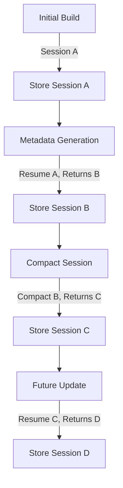

# Session Resumption Implementation Plan

## Executive Summary

Implement Claude session resumption for the `/update-project` endpoint to reduce costs, improve context awareness, and speed up project updates. Currently, each update creates a new Claude session, losing all context from previous work.

## Current State Analysis

### What Works Now
1. **Session Storage**: Session IDs are stored in three locations:
   - Redis (temporary, 1-hour TTL) for crash recovery
   - In-memory Map for immediate access during build
   - `project_ai_session_metrics` table for analytics

2. **Session Resumption**: Already implemented for metadata generation
   - Successfully resumes sessions for recommendations and documentation
   - Has fallback to new session if resume fails

3. **Session Compaction**: Runs after metadata generation to optimize context

### What's Missing
1. **No Persistent Link**: Session IDs are not linked to project versions
2. **Lost Context**: Each update starts fresh, requiring Claude to re-analyze the entire project
3. **Higher Costs**: Full context reload for every update
4. **Slower Updates**: Claude needs to understand the project structure repeatedly

## Proposed Solution

### Architecture Overview

```
┌─────────────────┐     ┌──────────────────┐     ┌─────────────────┐
│ /update-project │────▶│ Get Latest       │────▶│ Retrieve        │
│   Endpoint      │     │ Project Version  │     │ Session ID      │
└─────────────────┘     └──────────────────┘     └─────────────────┘
                                                           │
                        ┌──────────────────┐              ▼
                        │ Create New       │     ┌─────────────────┐
                        │ Session          │◀────│ Session Valid?  │
                        └──────────────────┘     └─────────────────┘
                                │                          │ Yes
                                │                          ▼
                        ┌───────▼──────────┐     ┌─────────────────┐
                        │ Store Session ID │     │ Resume Session  │
                        │ with Version     │     └─────────────────┘
                        └──────────────────┘
```

### Database Schema Changes

1. **Add to `project_versions` table**:
```sql
ALTER TABLE project_versions ADD COLUMN ai_session_id TEXT;
ALTER TABLE project_versions ADD COLUMN ai_session_created_at TIMESTAMP;
ALTER TABLE project_versions ADD COLUMN ai_session_last_used_at TIMESTAMP;
CREATE INDEX idx_project_versions_session ON project_versions(ai_session_id);
```

**Important Note**: Claude generates a new session ID with every operation, including:
- Initial project creation
- Every update
- After running `/compact`
- When resuming a session

This means we must always track and use the **most recent session ID** returned by Claude.

2. **Session validity tracking**:
```sql
-- Track session health and usage
ALTER TABLE project_ai_session_metrics ADD COLUMN is_resumable BOOLEAN DEFAULT true;
ALTER TABLE project_ai_session_metrics ADD COLUMN resume_failure_count INTEGER DEFAULT 0;
```

### Implementation Strategy

#### Phase 1: Database Foundation
1. Create migration to add session columns to `project_versions`
2. Update `ProjectVersion` TypeScript interface
3. Modify database wrapper functions to handle session data

#### Phase 2: Session Storage
1. Update `streamWorker` to store session ID with version after successful build
2. Modify `updateProjectVersionStatus` to accept session information
3. **Critical**: Update session ID after EVERY Claude operation:
   - After main build completion
   - After metadata generation
   - After session compaction (stores the NEW session ID from `/compact`)
   - The session ID in the database must ALWAYS be the most recent one

#### Phase 3: Session Retrieval and Resume
1. Update `getLatestProjectVersion` to include session information
2. Modify `/update-project` endpoint to pass session ID through the queue
3. Update `StreamJobData` interface to include `previousSessionId`
4. Modify `streamWorker` to attempt session resume for updates

#### Phase 4: Robustness and Edge Cases
1. Implement session age validation (sessions older than 24 hours considered stale)
2. Add retry logic with exponential backoff for resume attempts
3. Track resume success/failure rates
4. Implement session refresh strategy

### Security Considerations

1. **Project Isolation**: Ensure sessions are strictly bound to their projects
   ```typescript
   // Validate session belongs to project
   const sessionMetrics = await getSessionMetrics(sessionId);
   if (sessionMetrics.projectId !== projectId) {
     throw new Error('Session security violation');
   }
   ```

2. **User Validation**: Verify session belongs to the requesting user
3. **Session Expiry**: Automatic invalidation of old sessions
4. **Audit Trail**: Log all session resume attempts

### Session ID Management

**Key Principle**: The session ID changes with every Claude operation, so we must:

1. **Always capture the new session ID** from:
   - `result.sessionId` after main build
   - New session ID after metadata generation
   - New session ID after `/compact` operation

2. **Update storage immediately**:
   ```typescript
   // After any Claude operation
   if (result.sessionId && result.sessionId !== previousSessionId) {
     await updateProjectVersionStatus(versionId, status, {
       ai_session_id: result.sessionId,
       ai_session_last_used_at: new Date()
     });
   }
   ```

3. **Session ID Chain**:
   - Build creates session A
   - Metadata generation resumes A, returns session B
   - Compact uses B, returns session C
   - Next update must use session C

### Edge Cases and Error Handling

1. **Session Not Found**:
   - Already handled with fallback to new session
   - Log occurrence for monitoring

2. **Session Corrupted**:
   - Detect via failed resume with unexpected errors
   - Mark session as non-resumable
   - Create new session

3. **Concurrent Updates**:
   - Use database locks or Redis distributed locks
   - Queue updates to prevent session conflicts
   - Consider session branching for parallel work

4. **Major Project Changes**:
   - Detect significant structural changes
   - Optionally invalidate old sessions
   - Create fresh session for clean start

### Session Tracking Flow



### Monitoring and Metrics

1. **Success Metrics**:
   - Session resume success rate
   - Cost reduction percentage
   - Update speed improvement
   - Context retention quality
   - Session ID update frequency

2. **Health Metrics**:
   - Session age distribution
   - Resume failure reasons
   - Session storage size
   - Concurrent session usage

### Migration Plan

1. **Phase 1**: Deploy database changes (backward compatible)
2. **Phase 2**: Deploy session storage logic (start collecting sessions)
3. **Phase 3**: Enable session resumption (with feature flag)
4. **Phase 4**: Monitor and tune based on metrics
5. **Phase 5**: Remove feature flag, make default behavior

### Implementation Progress

### ✅ Completed (2025-07-26)

1. **Database Foundation**
   - Created migration `018_add_session_tracking_to_project_versions.sql`
   - Added columns: `ai_session_id`, `ai_session_created_at`, `ai_session_last_used_at`
   - Added index on `ai_session_id`
   - Added session health tracking columns to metrics table

2. **TypeScript Updates**
   - Updated `ProjectVersion` interface with session fields
   - Updated `BuildJobData` interface with `previousSessionId`
   - Modified database functions to allow session field updates

3. **Session Storage Implementation**
   - `streamWorker` now stores session ID after main build completion
   - Session ID updated after metadata generation
   - Session ID updated after compaction (captures new ID)
   - Added `aiSessionCreatedAt` and `aiSessionLastUsedAt` tracking

4. **Session Retrieval Flow**
   - `/update-project` endpoint fetches latest version with session ID
   - Session ID passed through queue via `previousSessionId`
   - `enqueueBuild` forwards session ID to stream worker

5. **Session Resumption Logic**
   - Stream worker attempts to resume session for updates
   - Fallback to new session if resume fails
   - Proper logging of resume attempts and outcomes

6. **Session ID Chain Management**
   - `compact()` method returns new session ID
   - Final session ID stored after all operations
   - Handles session ID updates throughout the lifecycle

### 🔄 Pending

1. **Testing and Validation**
   - Run database migration
   - Test end-to-end flow
   - Verify session resumption works
   - Check cost reduction

2. **Monitoring and Metrics**
   - Add session resume success tracking
   - Monitor cost savings
   - Track session age and validity

3. **Edge Cases**
   - Session expiry handling
   - Concurrent update protection
   - Major structural change detection

### Rollback Plan

1. Feature flag to disable session resumption
2. Fallback to creating new sessions (current behavior)
3. Database changes are additive (no data loss on rollback)
4. Session data can be retained for future retry

### Success Criteria

1. **Cost Reduction**: 30-50% reduction in API costs for updates
2. **Speed Improvement**: 40-60% faster update completion
3. **Reliability**: >95% session resume success rate
4. **Context Quality**: Improved update accuracy with historical context

### Future Enhancements

1. **Session Branching**: Support multiple parallel update streams
2. **Session Templates**: Pre-warmed sessions for common operations
3. **Cross-Project Learning**: Shared context for similar projects
4. **Intelligent Pruning**: ML-based session lifecycle management

## Next Steps

1. ✅ ~~Review and approve implementation plan~~
2. ✅ ~~Create detailed migration scripts~~
3. ✅ ~~Update TypeScript interfaces~~
4. ✅ ~~Implement core functionality~~
5. 🔄 Run migration and test the implementation
6. 📊 Set up monitoring and metrics collection
7. 📝 Update API documentation

## Testing Checklist

- [ ] Run database migration
- [ ] Create initial project
- [ ] Verify session ID is stored
- [ ] Update project and verify session resume
- [ ] Check logs for resume success
- [ ] Compare costs with/without resume
- [ ] Test fallback when session not found
- [ ] Verify session ID chain updates correctly

## Risks and Mitigations

| Risk | Impact | Mitigation |
|------|--------|------------|
| Session corruption | High | Automated validation and fallback |
| Storage growth | Medium | Regular pruning and size limits |
| API changes | High | Version compatibility checks |
| Security breach | Critical | Strict validation and audit logs |
| Performance degradation | Medium | Caching and lazy loading |

## Conclusion

Implementing session resumption for project updates will significantly improve the user experience while reducing operational costs. The phased approach ensures safe deployment with minimal risk to existing functionality.
